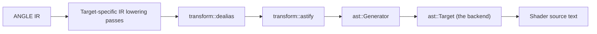

# `astify` and the Contract for Textual Shader Backends (`ast::Target`)

**What `astify` is.** ANGLE IR is SSA-like: one register per intermediate value. A backend that
gave every register a name would produce correct but unreadable output. `astify` is the IR-to-IR
pass that runs just before source generation and decides, register by register, which ones may be
folded back into a nested expression and which ones must be named. Where a name is required,
`astify` rewrites that function's IR itself, so the backend only ever sees ordinary instructions.

**What that means for a backend.** An `ast::Target` should be a near 1:1 mapping from IR opcodes
to source text. `astify` does the hard part, and it does it for *arbitrary* IR -- not just the IR a
GLSL parser happens to produce, since every target-specific pass is free to rewrite it first.
After the `astify` pass, backends need not worry about duplicating side effects as long as IR
opcodes are mapped 1:1 to source text. However, if a backend maps an IR opcode to multiple
statements, it must ensure it does not involve side effects. See section 4 for an example.

## 1. Pipeline position



## 2. What `astify` does

`d[i] = (a + b) * c;` is half a dozen registers:

```text
%r0 = Load %a
%r1 = Load %b
%r2 = Add %r0, %r1
%r3 = Load %c
%r4 = Mul %r2, %r3
%r5 = Load %i
%r6 = AccessArrayElement %d, %r5
      Store %r6, %r4
```

Naming each one gives unreadable bloat, which downstream driver compilers (Mesa, Tint, the Metal
compiler, DXC) then have to chew back through:

```wgsl
let _tmp1 = a + b;
let _tmp2 = _tmp1 * c;
d[i] = _tmp2;
```

where the natural output is just:

```glsl
d[i] = (a + b) * c;
```

Inlining cannot be unconditional, though. There are three reasons a register may have to be named:

* It reads memory that something mutates before the point of use. Inlining defers the read, so the
  inlined expression would observe the *new* value.
* It is read more than once. Inlining then duplicates the computation, and whether that costs
  anything depends on the driver's optimizer.
* It is too deeply nested. Inlining unboundedly produces expression trees that overflow the stack
  in recursive driver AST visitors.

So `astify` names a register only when it has to -- the first reason via `has_side_effect`, the
other two together via `is_complex`:

```rust
let cache_in_variable_if_necessary =
    (info.has_side_effect && read_any_times) || (info.is_complex && read_multiple_times);
```

When that holds, `astify` rewrites the instruction in the function's IR, in place, before the
backend runs: `%result = <op>` becomes `%new = <op>; Store %tmp, %new; %result = Load %tmp`. The
backend then sees a plain assignment and a plain load, with no special case to handle. When it does
not hold, the instruction produces no statement of its own and is inlined at each consumer.

`Access*` opcodes are a separate matter: they produce *pointer* registers, and `astify` never names
one. GLSL and ESSL have no pointer variables at all, and neither does HLSL. MSL and WGSL do have
pointers, but not in a form a generator can rely on -- MSL requires every pointer to carry an
address-space qualifier, and WGSL forbids pointers to vector components and matrix columns, does not
allow pointers to be stored, and restricts passing them to user-defined functions. There is nothing
portable to name a pointer register, so backends turn each `Access*` into an lvalue path
fragment (`arr[i].xy`). `astify` instead walks the access chain and counts each dynamic index
register as a read by the enclosing load, store or call.

## 3. The guarantee

> If `astify` leaves a register un-named, the value that register denotes cannot change between the
> register's definition and any of its uses. `astify` has already established that nothing in
> between can have altered it -- no `Store`, no `Call`, no increment. Had anything been able to,
> `astify` would have named it.

`astify` may conservatively over-name to provide this guarantee, but it should never under-name.
Consequently **backends may write out an un-named register's expression as many times as needed.**
Duplication is not, by itself, a hazard.

For example, WGSL has no projective texture sampling, so the backend must do the divide itself,
writing the coordinate twice (and more times again for shadow and array samplers):

```wgsl
_uoutColor = textureSample(ANGLE_texture_s, ANGLE_sampler_s, ((_uvcoord).xy / (_uvcoord).w));
```

That stays correct even when the GLSL coordinate was a call to a side-effecting function, because
`astify` names the call first and the duplicated text is then only an identifier:

```wgsl
var _u_unnamed_4 : vec4<f32>;
_u_unnamed_4 = fgetCoord_0();
_uoutColor = textureSample(ANGLE_texture_s, ANGLE_sampler_s, ((_u_unnamed_4).xy / (_u_unnamed_4).w));
```

## 4. Managing side effects and program order

> **A backend must strictly preserve the IR's implicit program order and evaluation semantics: it
must never duplicate an expression with side effects, nor emit any expression (whether deferred or
duplicated) after its values could have been mutated by subsequent instructions.**

`astify` reasons about mutations that exist as IR instructions. It cannot reason about mutations
that first come into existence during source generation.

### Example mistranslation

While duplicating an expression such as `++i` is obviously incorrect, there are more subtle
examples. For example, WGSL forbids assigning to a multi-element swizzle (`v.xy = w;`), and a store
through a multi-element-swizzle pointer can become one assignment per component.

Take `array[no_side_effect_index].xy = value;`. Naively, this expression may be translated as
follows:

```wgsl
array[no_side_effect_index].x = value.x;
array[no_side_effect_index].y = value.y;
```

However, this will be incorrect if `no_side_effect_index` is `array[0].x` (with an initial value of
0), because the first statement modifies the index, which is not supposed to be modified before the
second statement.

## 5. Recommendation: prefer IR lowering to textual lowering

When the target language lacks a feature, lowering it into primitive IR (`Load`, arithmetic,
`Store`, `Call`) in a pass that runs before `astify` keeps hazard detection and naming centralized
in `astify`, and keeps the backend a syntax mapper. This is a recommendation, not a requirement.

A backend that does synthesize a multi-statement sequence itself owns the problem, and has three
ways out: hoist every reused subexpression into backend-owned temporaries; arrange the sequence so
that nothing is reused across the mutating statement, or so that it contains no mutating statement
at all; or emit the sequence as a generated helper function and call it, so the IR op still maps to
a single statement.

## 6. Checklist for a new or modified `ast::Target` method

* Does it emit more than one statement into `block`? If none of them mutates memory, there is
  nothing to worry about.
* If one of them does mutate memory, is any expression written on both sides of it? That is the bug.
* One exception: for ops `astify` already treats as mutating -- calls, increments, atomics -- it has
  already named both the op's pointer-argument indices and, at its first read, the op's own result,
  so the backend's returned expression is consumed by the very next statement. This is why a textual
  increment lowering happens to work while a textual swizzle-store lowering does not.
* Does it respect `has_side_effect_with_unused_result` (emit the op as a standalone statement when
  its result is unused)?
* Writing an un-named register's expression N times is fine -- temporaries should not be added
  defensively.
